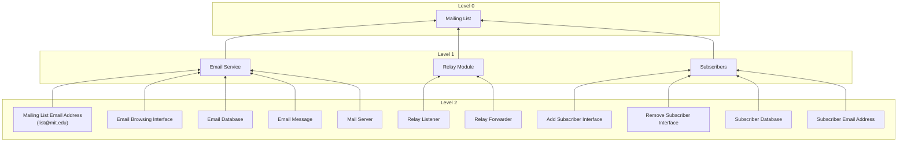
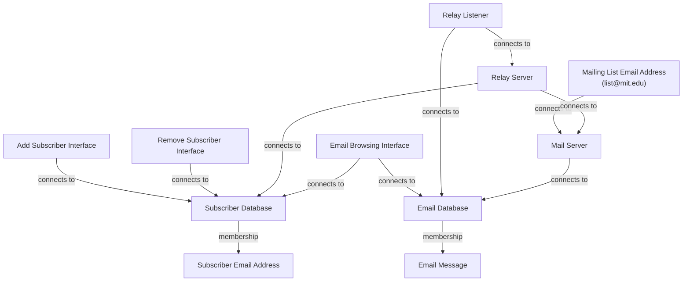

# Mailing List Decomposition

```mermaid
graph BT
subgraph Level 0
mailing-list[Mailing List]
end

subgraph Level 1
email-service[Email Service]
relay[Relay Module]
subscribers[Subscribers]
end

subgraph Level 2
list-address["Mailing List Email Address
(list@mit.edu)"]

email-browser[Email Browsing Interface]
email-storage[Email Database]
email-message[Email Message]
mail-server[Mail Server]

receipt-trigger[Relay Listener]
relay-server[Relay Forwarder]

add-email[Add Subscriber Interface]
remove-email[Remove Subscriber Interface]
subscriber-list[Subscriber Database]
subscriber-email[Subscriber Email Address]
end

email-service --> mailing-list
relay --> mailing-list
subscribers --> mailing-list

list-address --> email-service
email-browser --> email-service
email-storage --> email-service
email-message --> email-service
mail-server --> email-service

receipt-trigger --> relay
relay-server --> relay

add-email --> subscribers
remove-email --> subscribers
subscriber-list --> subscribers
subscriber-email --> subscribers
```

# Mailing List Formal Structure

```mermaid
graph

list-address["Mailing List Email Address
(list@mit.edu)"]

email-browser[Email Browsing Interface]
email-storage[Email Database]
email-message[Email Message]
receipt-trigger[Relay Listener]

relay-server[Relay Server]
mail-server[Mail Server]

add-email[Add Subscriber Interface]
remove-email[Remove Subscriber Interface]
subscriber-list[Subscriber Database]
subscriber-email[Subscriber Email Address]


list-address -- connects to --> mail-server

add-email -- connects to --> subscriber-list
remove-email -- connects to --> subscriber-list


receipt-trigger -- connects to --> relay-server
relay-server -- connects to --> subscriber-list
relay-server -- connects to --> mail-server
email-browser -- connects to --> email-storage
email-browser -- connects to --> subscriber-list
receipt-trigger -- connects to --> email-storage
mail-server -- connects to --> email-storage


subscriber-list -- membership --> subscriber-email
email-storage -- membership --> email-message
```
